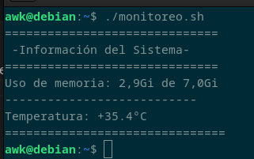

# monitoreo
Script sencillo que monitorea el uso de la memoria RAM y la temperatura del sistema.

Utiliza los comandos "free" y "sensors".

Es posible que más adelante le añada más funcionalidades.

### How to use
1. Clona el repositorio
```
sudo git clone https://github.com/diego2444/monitoreo.git
```
2. Entra en la carpeta
```
cd monitoreo
```
3. Dale permisos al script
```
sudo chmod +x monitoreo.sh
```

3. Ejecuta el script
```
./monitoreo.sh
```

Debería salir algo así:


